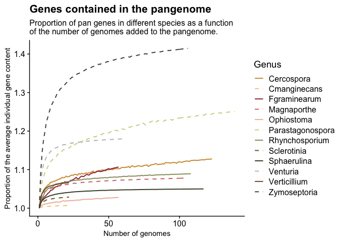
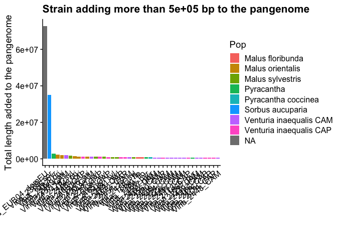
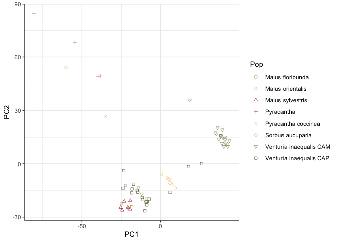

This repository contains preliminary analyses created to inform my project 
proposal for the position of Junior Professor at Angers University.

Based on data previously published in [Le Cam et al 
2019](https://doi.org/10.1534/g3.119.400047), I assembled a 
pangenome with a skeleton of long-read assembly and sequence pieces 
added from short-read assemblies. By comparing with other species, I found 
that the pangenome of *V. inaequalis* is on the larger side. 

I looked by strain to find out which isolates were adding more length to 
the pangenome and identified one main secondary contributor, an isolate 
from *Sorbus aucuparia*. In addition, some length was added by the 
isolates from *Pyracantha* and *Malus orientalis*. 

I aligned all the resequencing datasets on the pangenome and identified 
presence-absence of genes for each isolates. Using a dimension reduction 
method (PCA), I showed that the gene presence-absence seem sufficient to 
separate isolates from different hosts.

This suggests that host specificity in *V. inaequalis* might be 
genetically determined at 
least in part by structural variants such as gene presence-absence 
variation. 
